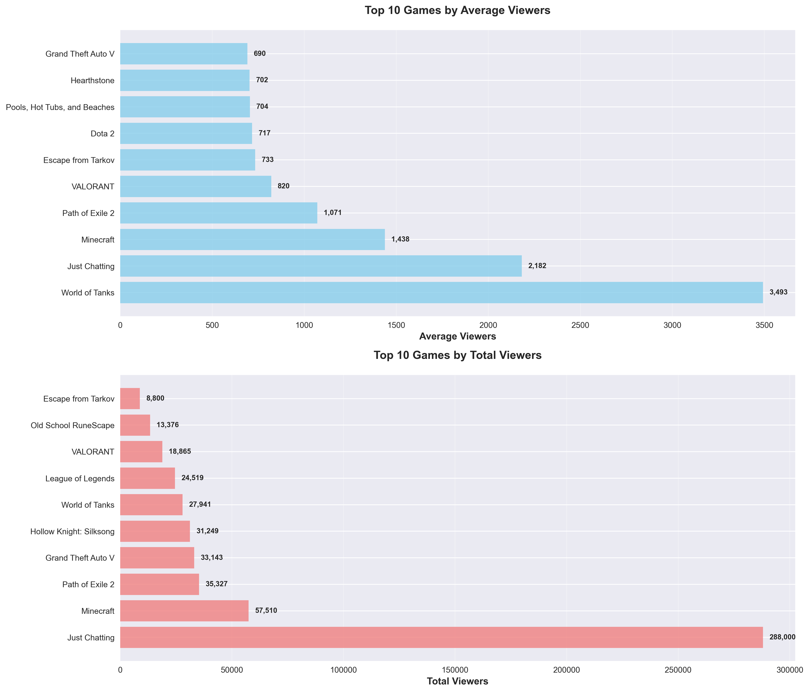
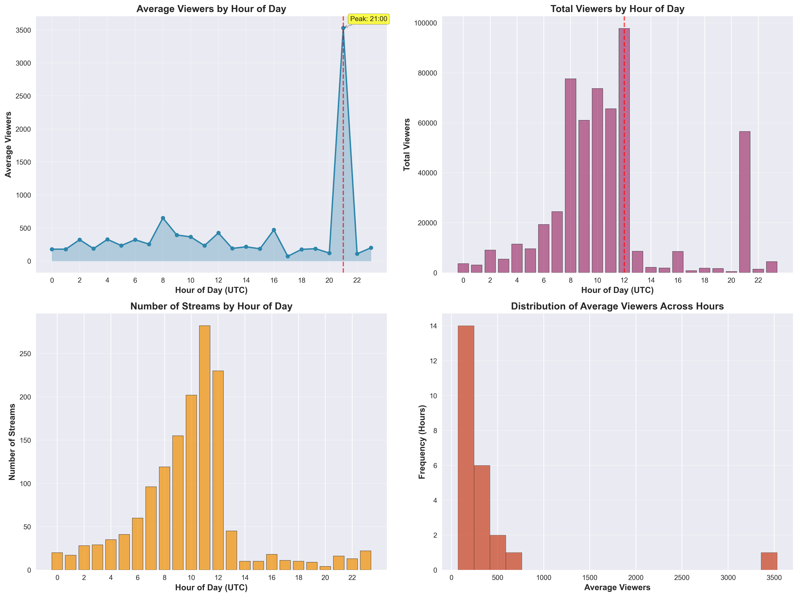

# 🎮 Twitch Streaming Analytics (with Airflow ETL)

A **data engineering and analytics project** that ingests live data from the **Twitch API**, processes it with **Apache Airflow**, and stores insights in a **Postgres database**.  
It demonstrates **ETL (Extract–Transform–Load)** pipelines, **data quality checks**, **trend analysis**, and **visualisation** — finished with stakeholder-ready outputs.  

---

## 🚀 What This Project Does  

- 📡 **Extracts live data** from Twitch (stream metadata, game categories, viewers)  
- ⚙️ **Automates ETL pipeline** with **Airflow DAGs** (scheduled runs, retries, monitoring)  
- 🧹 **Cleans and validates** data (deduplication, UTF-8 handling, schema enforcement)  
- 🗄️ **Loads into Postgres** for structured analytics  
- 📊 **Analyses streaming trends** by game, category, and viewers  
- 📈 **Produces visuals & summaries** (most-watched games, viewer trends, game diversity)  

---

## 🧰 Tech Stack  

- **Data Orchestration**: Apache Airflow (Docker Compose)  
- **Database**: PostgreSQL (with SQLAlchemy + psycopg2)  
- **Python**: `pandas`, `numpy`, `requests`, `python-dotenv`  
- **Visualisation**: `matplotlib`  
- **Containerisation**: Docker & docker-compose  
- **Config Management**: `.env` for Twitch API secrets  

---

## 📁 Repository Structure  

```
twitch-streaming-analytics/
├── README.md                   # Project overview (this file)
├── docker-compose.yaml          # Services: Airflow + Postgres
├── dags/
│   ├── twitch_etl_dag.py       # Main Airflow DAG
│   ├── extract_twitch.py       # Extract: Twitch API calls
│   ├── transform.py            # Transform: clean & enrich data
│   └── load.py                 # Load: push to Postgres
├── scripts/                    # Standalone ETL scripts
│   ├── auth.py                 # Twitch API authentication
│   ├── extract_twitch.py       # Extract: Twitch API calls
│   ├── transform.py            # Transform: clean & enrich data
│   ├── load_db.py              # Load: push to SQLite
│   └── run_etl.py              # Complete ETL pipeline
├── analysis/                   # Analysis scripts
│   ├── top_games.py            # Top games analysis
│   ├── peak_hours.py           # Peak hours analysis
│   └── weekend_analysis.py     # Weekend vs weekday analysis
├── db/
│   └── twitch.db               # SQLite database
├── data/                       # Raw + processed CSVs
├── outputs/
│   └── plots/                  # Generated plots (PNG)
├── .env.example                # Example environment variables
└── requirements.txt            # Python dependencies
```

---

## ▶️ How to Run (Local, Python + SQLite)

### 1. Create a virtual environment  

**Windows PowerShell**
```powershell
python -m venv venv
venv\Scripts\Activate.ps1
```

**macOS/Linux**
```bash
python3 -m venv venv
source venv/bin/activate
```

---

### 2. Install dependencies  
```bash
pip install -r requirements.txt
```

---

### 3. Configure environment variables  
Copy the example file and add your Twitch API credentials:  

**Windows**
```powershell
copy .env.example .env
```

**macOS/Linux**
```bash
cp .env.example .env
```

Edit `.env`:
```env
TWITCH_CLIENT_ID=your_twitch_client_id
TWITCH_CLIENT_SECRET=your_twitch_client_secret
```

---

### 4. Run the ETL pipeline (local, SQLite target)  
```bash
python scripts/run_etl.py
```
✅ Produces:  
- `data/raw/streams_raw.csv` (raw API data)  
- `data/processed/streams_processed.csv` (cleaned/enriched)  
- `db/twitch.db` (SQLite database with `streams` table)  

---

### 5. Run analysis scripts  
```bash
python analysis/top_games.py
python analysis/peak_hours.py
```
✅ Produces plots in `outputs/plots/`:
- `top_games.png` – Top games by viewers  
- `peak_hours.png` – Hourly viewing trends  

---

## ▶️ How to Run (Docker + Airflow + Postgres)

### 1. Start Docker services  
```bash
docker compose up -d
```

- Airflow web UI → [http://localhost:8080](http://localhost:8080)  
- Postgres DB → `localhost:5432`  

Login to Airflow:  
- **Username**: `airflow`  
- **Password**: `airflow`  

---

### 2. Trigger the ETL DAG  
- Open the Airflow UI.  
- Enable the `twitch_etl_dag`.  
- Monitor tasks: `extract → transform → load`.  
- Data lands in Postgres `streams` table.  

---

### 3. Run analysis scripts  
Even when using Docker/Postgres, you can run the same analysis scripts locally:  

```bash
python analysis/top_games.py
python analysis/peak_hours.py

```

Outputs → `outputs/plots/`

---

## 📊 Example Visuals  

**Top Games by Average Viewers**  
  

**Peak Hours Analysis**  
  

### PowerBI example visual


---

## 🎯 Why This Project Matters  

This project showcases **real-world data engineering**:  

- **ETL pipelines** with Airflow for reliability, retries, and scheduling  
- **API integration** with Twitch’s OAuth flow and rate limits  
- **Database design & SQL analytics** for structured insights  
- **Exploratory analysis & visualisation** for stakeholder reporting  
- **Containerised deployment** for reproducibility (Docker)  

---

## 🔒 Notes  

- `.env` is git-ignored — never commit secrets  
- Airflow uses a Postgres backend (persistent via Docker volume)  
- Extend project: add sentiment analysis on Twitch chat logs, or track streamer growth over time  
